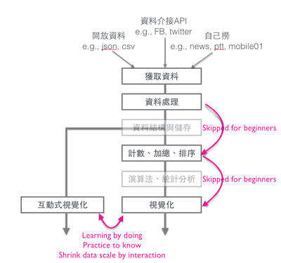

# Announcement
* [Materials][1]
* [Forum][2] Classmates can ask any questions about course and practices here.
* [FW:滴水不漏的使用者研究，讓「UBike」成為最受歡迎的台北公共自行車 app][3]

# Links
* [Syllabus][4]
* [Moodle2][5] (visitor pswd:123456)
* [A Gallery of ipython notebook][6]
* [ipython notebook][7]
* [My Diigo Outliner: Python][8]
* [Lectures of last semester][9]
* Visualization resources: Visualizing by ipython notebook and other javascript library
	* google fusion table
	* google chart API
	* [plot.ly][10] - Using d3.js for visualization on ipython
	* [d3.js on nbviwer][11], [d3.js examples][12]
	* [highCharts on nbviewer][13]

# Videos for review
* 2015/04/16 [分析chrome history - 處理網址次數做排序、轉時間的格式、使用pandas分析][14]
* 2015/04/23 [分析chrome history - 將資料import成表格,html檔、時間轉函式、分析網址，做合併、視覺化呈現資料][15]
* 2015/05/07 [以Canopy讀python、分析twitter，使用twitter API、期中考題檢討][16]
* 2015/05/14 [在google map標注腳踏車站][17]
* 2015/05/21 [分析twitter，tag字串的處理][18]
* 2015/05/28 [python class說明、讀檔案寫檔案的方法、分析新聞報導][19]
* 2015/06/04 [分析期刊的跨領域使用和引用、分析新聞報導，過濾列出日期和新聞標題][20]

# Calendar

## 0618
* [Upload final project (due:06/29 00:00)][21]
	* 評分標準：對程式碼的說明與結果的詮釋（50%）、技術難度（30%）、創新議題（20%）
	* 「你必須」執行過你自己所上傳的程式碼，好讓執行結果顯示在上傳的檔案中。並且要用markdown的方式做註解，好讓別人看得懂你每一個block的程式碼在做什麼，
	並解釋你執行出來的結果，解釋那些數據代表什麼意思。也就是說，就像寫報告一樣，你得用報告的方式說明你在做什麼，而不是等別人逐行看你的程式碼。
	* 請上傳一個壓縮檔，裡面包含一個HTML檔和一個ipynb檔
	* 若超過容量限制無法上傳請寄給助教宜芳（erin2726@gmail.com）

## 0604 News data mining and Information Retrieval

## 0528 Crawling and Storing news data
* [Submitting Practice0527][22]
	* Finding cross-discipline journals from journal citation report 102 (snapshop study)
	* Detecting reputation changes of journals (longitudinal study)

## 0521 Network Visualization on twitter #hashtag
* [Proposal for term project][23] Due: 05/27 23:59
* 有同學問到說Google Map畫到最後得用JavaScript，能不能直接用python寫，答案是沒辦法。因為Google Map就是JavaScript，換個語言，也是去Generate JavaScript Code。只是方便你作業而已。

## 0511 Geo-visualization: Mapping youbike data
* [轉載：視覺化實戰 － D3.js 地理區塊視覺化][24]。各位可以下載他的程式碼，然後嘗試更動index.js中的density，或者把density寫成一個json檔案，然後用d3.json去load該json檔案，這樣你就該檔案。

## 0507 Query Twitter data

## 0430
* [Submitting Practice0430][25] Due:05/13 23:59

## 0423 Timeline visualization (by Google Chart API): Chrome histry
* [Export to .py][26]
* [Review hints][27]
* [Online book for review][28] Reading Ch.1\~9 except Ch.7

## 0416 Chrome history
* [Instruction for Practice0326][29]
* Midterm: 04/30

## 0409
* [Submitting Practice0409][30] Due 04/15 23:59

## 0326 Visualizing Youbike data
* [Video][31] Due to Dropbox is not designed for streaming video, please DOWNLOAD them if you needs.
* [Submitting Practice0326][32] Due 04/08 23:59
	* Export your code and result __as html__ then submit it.
* NEXT WEEK: If you are not a Chrome browser user, please install it temporarily in your computer and try to use it. We will show how to read a local database by using Chrome visit history as an example.

## 0319 Getting and Processing Youbike data
* Download 0319 course material from [here][33]
* Practice0319 (Closed)
	* Export your code and result __as html__ then submit it.

## 0312 From counting fruits to Youbike
* Submitting Practice0312 (closed)
	* [Practice0312][34] preview
	* Download the /quiz/Practice0312.ipynb and modify it to fit the answer.
	* Export your code and result __as html__ then submit it.

## 0305 Your first program: Counting the fruit
* Submitting Practice0305 (Closed)
	1. Using print-screen to show the json and paste to a file.
	2. Follow the 1st step, state the hyperlink of the data source, and describe the data.
	3. If a data field is available on the open data site, upload the description of data field also.

## 0227 Coding with "Alsa," the snow queen?
* Submitting Practice0227 (Closed)
* Next week
	* Must [INSTALL][35] Enthought Canopy.
	* Submit your screenshot of playing Elsa game on code.org to moodle platform.

[1]:	http://nbviewer.ipython.org/github/jirlong/pss2015/tree/master/
[2]:	https://groups.google.com/d/forum/ntnu_pss
[3]:	http://www.inside.com.tw/2015/04/02/ubike-app-user-research
[4]:	https://docs.google.com/document/d/1Ff4Bzufrc-kw40OQmUQsSwE5cPKdQH3e0Uh4VL_E9Fo/edit?usp=sharing
[5]:	http://moodle2.ntnu.edu.tw
[6]:	https://github.com/ipython/ipython/wiki/A-gallery-of-interesting-IPython-Notebooks#pandas-for-data-analysis
[7]:	http://nbviewer.ipython.org/github/ipython/ipython/tree/1.x/examples/notebooks/
[8]:	https://www.diigo.com/outliner/1q0y6n/python?key=m0q5lam5b6
[9]:	https://www.dropbox.com/sh/ze5myvqryhygucr/AAAHptjsqkGDCNhB1POyorN0a?dl=0
[10]:	https://plot.ly/
[11]:	http://nbviewer.ipython.org/github/fperez/talk-strata-sc2014/blob/master/d3%20in%20the%20notebook.ipynb
[12]:	http://biovisualize.github.io/d3visualization/
[13]:	http://nbviewer.ipython.org/github/gtnx/pandas-highcharts/blob/master/example.ipynb
[14]:	https://icloud.itc.ntnu.edu.tw/navigate/s/C39C87F037374E8C8F747FE697CAE56FVQY
[15]:	https://icloud.itc.ntnu.edu.tw/navigate/s/C61297CC31204A2D85A59CDE43209DE3VQY
[16]:	https://icloud.itc.ntnu.edu.tw/navigate/s/CF4E9FB155C042F7A8B85BDBBD9A3D2AVQY
[17]:	https://icloud.itc.ntnu.edu.tw/navigate/s/7F85A28B480E45E68798FC1003C0D90EVQY
[18]:	https://icloud.itc.ntnu.edu.tw/navigate/s/EA5D3D769CCB49B2B95BC4BC98AC6DCCVQY
[19]:	https://icloud.itc.ntnu.edu.tw/navigate/s/BAB9F4D635804002A9BAC0BBF8790913VQY
[20]:	https://icloud.itc.ntnu.edu.tw/navigate/s/1C0311F62DCB4EDD8B40226CFEBE0B5EVQY
[21]:	http://form.jotform.me/form/51677090397465
[22]:	http://form.jotform.me/form/51512058243447
[23]:	http://form.jotform.me/form/51384614243452
[24]:	http://blog.infographics.tw/2015/04/visualize-geographics-with-d3js/
[25]:	http://form.jotform.me/form/51178232360449
[26]:	https://www.evernote.com/l/ABGj3WVuHxRHF62e1IM5ks3z22tyorTYVJw
[27]:	https://www.evernote.com/l/ABFHT5lh4MpMPJqx3qcvhVCFPT-ggDxlxbw
[28]:	http://www.pythonlearn.com/book.php
[29]:	https://icloud.itc.ntnu.edu.tw/navigate/s/A72A05E0C71C4A7083A2C49893D1580AVQY
[30]:	http://form.jotform.me/form/50975309851463
[31]:	https://www.dropbox.com/sh/q41les5hn11anv2/AAAb59rl9nNgGRTlz0sovy24a?lst
[32]:	http://form.jotform.me/form/50843640666459
[33]:	https://www.dropbox.com/s/6o108e07niednxe/Practice0319.zip?dl=0
[34]:	http://nbviewer.ipython.org/github/jirlong/pss2015/blob/master/quiz/Practice0312.ipynb
[35]:	https://github.com/jirlong/pss2015/blob/master/Lectures/C1-InstallingDevelopmentEnvironments.pdf

[image-1]:	/others/architecture.png